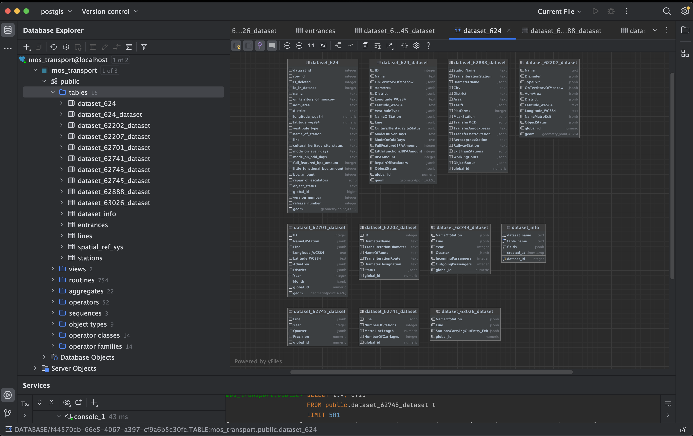
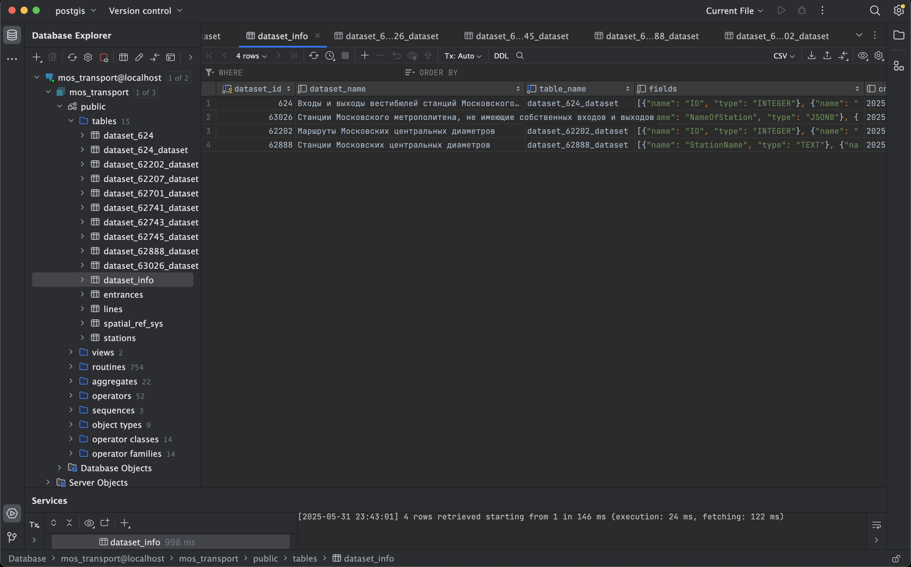
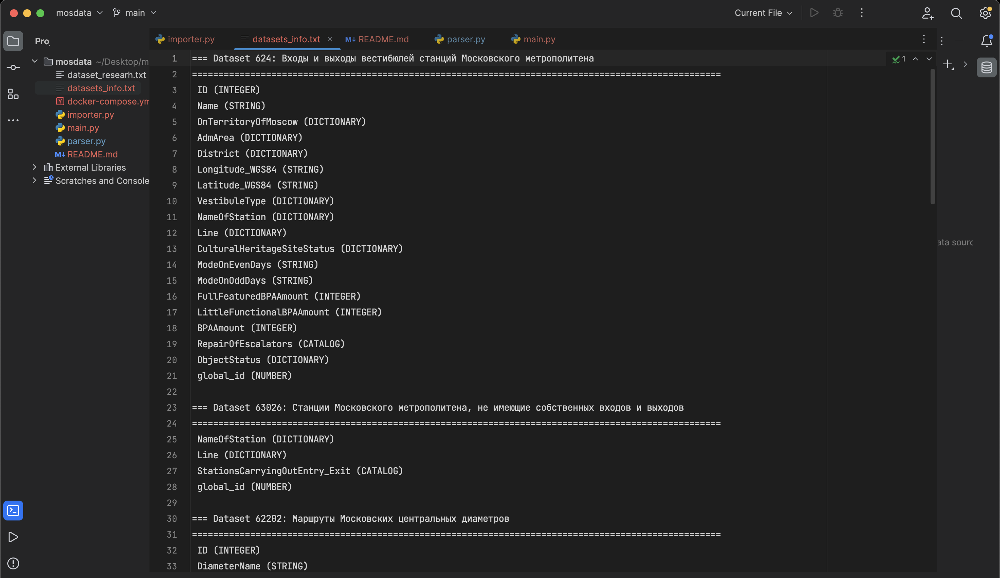
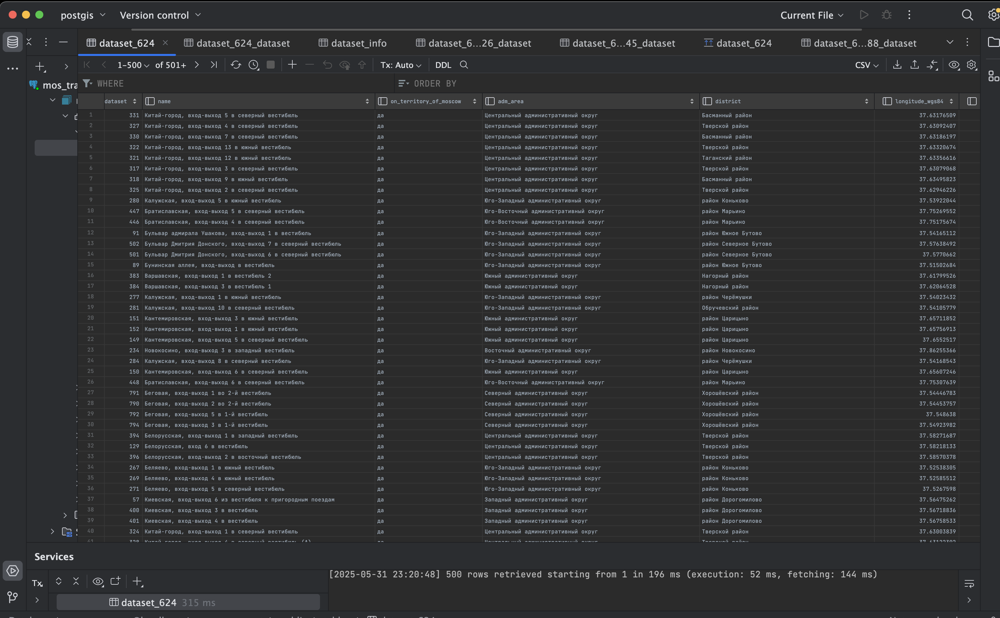
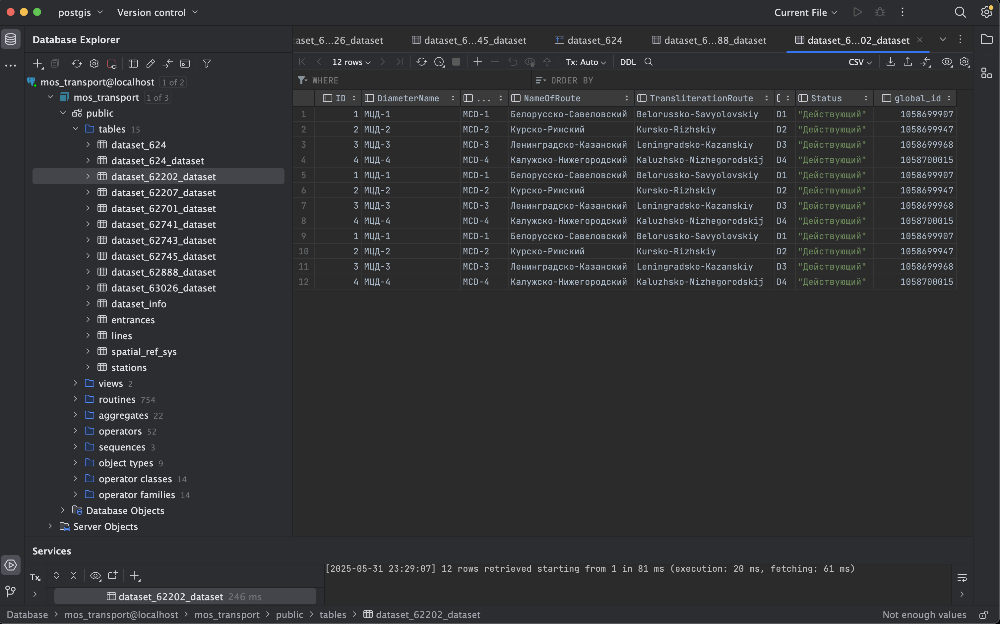
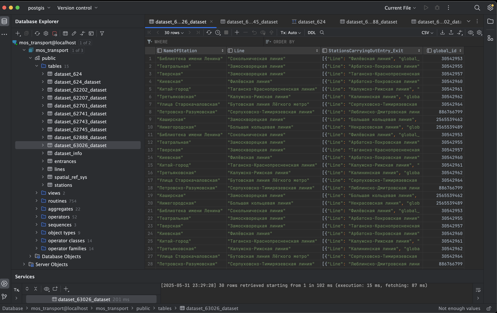
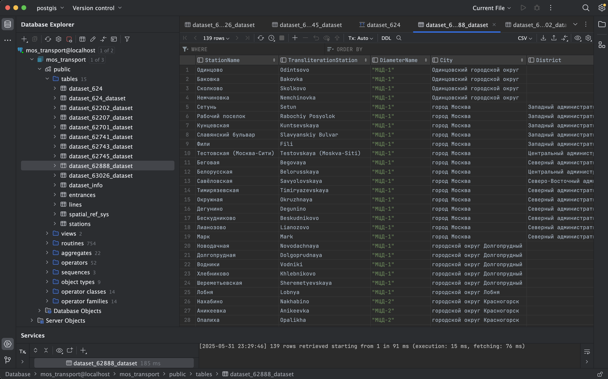

## Этот проект позволяет

1. Собрать список датаcетов категории Дороги и транспорт (ID 102) с `data.mos.ru`.
2. Отфильтровать те, что содержат метро / МЦД / МЦК / диаметр / кольц… в названии, и сохранить их описание в
   файл `datasets_info.txt`.
3. Для каждого из таких датаcетов автоматически создать в PostgreSQL(PostGIS) отдельную таблицу `dataset_{ID}_{slug}` (
   где `slug` — «фрагмент» из имени датаcета) и загрузить все GeoJSON-фичи из эндпоинта `/v1/features/{datasetId}`.
   В результате в бд появится по одной таблице на каждый метро-датаcет, с колонками, соответствующими полям из
   метаданных. Если в полях есть `Longitude_WGS84` и `Latitude_WGS84`, дополнительно создается колонка `geom` (
   тип `geometry(Point,4326)`), в которую записывается точка.

---
## Демонстрация
### 1. Список таблиц в базе данных `mos_transport`



Таблички:

- `dataset_info` – справочник, где хранится информация о каждом импортированном датасете (id, имя, список полей).  
  В правой части — ER диаграмма:
- `dataset_624_dataset` (входы/выходы метро),
- `dataset_62888_dataset` (станции МЦД),
- `dataset_62207_dataset` (входы/выходы МЦД)

### 2. Файл `datasets_info.txt` с описанием полей



Файл `datasets_info.txt`, здесь перечислены целевые датаcеты (id 624, 63026, 62202, 62888 и тд) с заголовком и перечнем
всех полей (имя + тип) из их метаданных

### 3. Таблица `dataset_624_dataset`



Таблица `dataset_624_dataset` (входы/выходы вестибюлей московского метрополитена) после вставки около 500 записей.  
Поля:

- `dataset_id` – всегда 624 (ID датаcета),
- `ID` – уникальный внутренний идентификатор входа/выхода,
- `name` – наименование входа/выхода (Китай-город, вход-выход 5…),
- `on_territory_of_moscow` (да/нет),
- `adm_area`, `district` – административный округ и район,
- `longitude_wgs84`, `latitude_wgs84` – координаты в виде числовых значений,
- `global_id` – внутренний глобальный идентификатор.
- `geom` – столбец типа `geometry(Point,4326)`, сгенерированная точка на основе координат.

---

### 4. Таблица `dataset_62202_dataset`



- **Описание**:  
  Таблица `dataset_62202_dataset` (Маршруты Московских центральных диаметров).
  Примечание: у этого датаcета нет координат, поэтому столбца `geom` нет.

---

### 5. Таблица `dataset_63026_dataset`



Таблица `dataset_63026_dataset` (Станции Московского метрополитена, не имеющие собственных входов/выходов).
Здесь тоже нет `geom`, так как координаты не передавались.
---

### 6. Таблица `dataset_62888_dataset`



Таблица `dataset_62888_dataset` (Станции Московских центральных диаметров).  
Поля:

- `StationName` (Одинцово, Баковка),
- `TransliterationStation` (латиница Odintsovo, Bakovka),
- `DiameterName` (МЦД-1 или МЦД-2),
- `City` (Одинцовский городской округ),
- `geom` (geometry(Point,4326) — точка, вычисленная из координат станции, поскольку
  поле `Latitude_WGS84`/`Longitude_WGS84` обнаружилось в датасете).

## Логика работы

1. **Анализ датаcетов**
    - Сначала система запрашивает у сервиса `data.mos.ru` полный список датаcетов, относящихся к категории Дороги и
      транспорт;
    - Затем из этого списка отбираются только те датаcеты, в названии которых встречаются ключевые слова (согласно
      задаче - метро, МЦД, МЦК, диаметр, кольцо).
    - Для каждого найденного датаcета формируется краткий отчет: его идентификатор, название и перечень полей (наборов
      данных).

2. **Создание таблиц в бд**
    - Для каждого отфильтрованного датаcета автоматически создается своя таблица в бд PostGIS;
    - Структура таблицы соответствует полям датаcета - каждый атрибут превращается в колонку с подходящим типом (текст,
      число, JSON и тд);
    - Если среди полей датаcета есть координаты (широта/долгота), дополнительно создается колонка для хранения
      геометрии (точка).

3. **Доп. загрузка геопризнаков**
    - После создания таблицы система запрашивает у API все записи (фичи) данного датаcета в формате geoJSON;
    - Каждая запись содержит свойства (атрибуты) и геометрию;
    - Атрибуты преобразуются в строки или числа согласно типу, а вложенные структуры (словарные или справочники)
      сохраняются в формате JSON внутри одной колонки;
    - Геометрические координаты (широта/долгота) преобразуются в объект Point и записываются в колонку с геометрией.

4. **Вставка данных**
    - Все записи одного датаcета вставляются в соответствующую таблицу одной групповой операцией;
    - После загрузки данных таблица полностью готова для запросов и анализа.

## Структура репозитория

````
├── parser.py           # собирает список датасетов и их метаданные
├── importer.py         # создает таблицы и загружает данные
├── main.py             # просто точка запуска: сначала parser, потом importer
├── docker-compose.yml  # запуск pg (postgis) в docker
├── datasets_info.txt   # файл-отчет
└── README.md   
````


